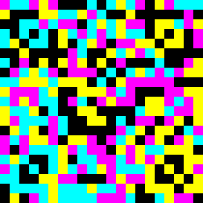

# JAB Code
Just Another Barcode (code)

## Implementation notes, spec, etc
Use [reference website](https://jabcode.org/create) for testing

Use the freely available [pdf reference](https://www.bsi.bund.de/EN/Service-Navi/Publications/TechnicalGuidelines/TR03137/BSITR03137.html) instead of the expensive ISO standard

MVP Aim: 

- data: `testing`
- colours: 4
- module size: 16
- x: 1
- y: 1
- ECC: 0

This should create a jabcode that is one square primary symbol, with side length 21 modules (336*336). As jabcode generation is a deterministic process, it should be identical in every way to testing.png. 